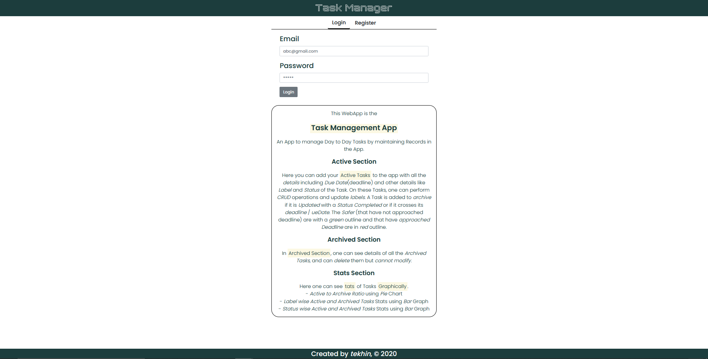
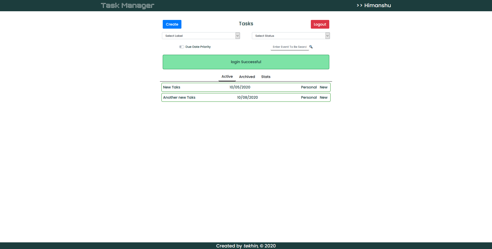
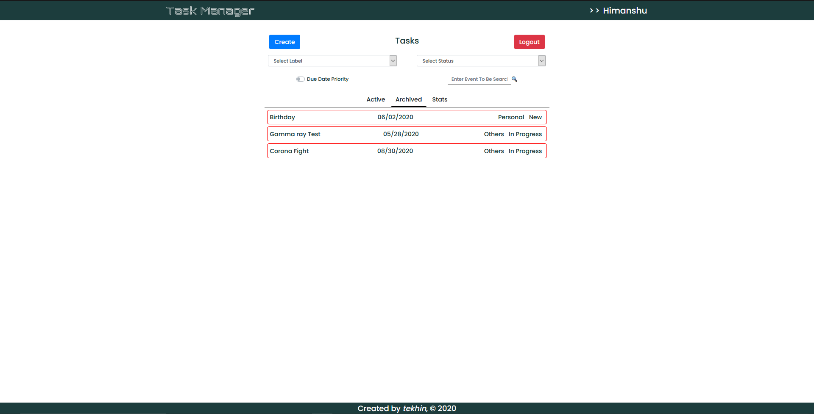
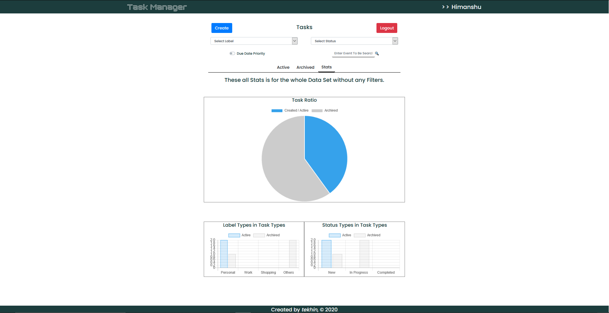
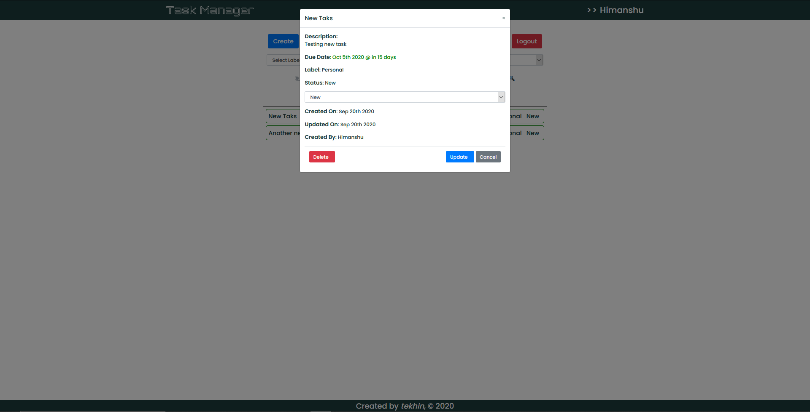

# **Task Management App 📅 👈**

 

 

> `Scheduling Tasks` is one of the most important step to manage your Day to Day Tasks.

This is the [Task Management App](https://myhacktaskmanager.netlify.app)

An App to manage `Day to Day Tasks` by maintaining Records in the App.
 
[Click for Client Repo](https://github.com/HyperLoo/TaskManager-Client)

## **Login and Register Section 🔑**

Here you can `Register` or `Login` to the App.  
_[ Uses JSON Web Token based Authentication.
Click [here](https://jwt.io/introduction/) to read more ]_  

## **Active Section 💼**

Here you can add your `Active Tasks` to the app with all the `details` including `Due Date`(deadline) and other details like `Label` and `Status` of the Task. On these Tasks, one can perform `CRUD` operations and update `labels`.

A Task is added to archive if it is `Updated` with a Status `Completed` or if it crosses its `deadline` / `dueDate`.

The `Safer` (that have not approached deadline) are with a `green` outline and that have `approached Deadline` are in `red` outline.  

## **Archived Section ⚙️**

In `Archived Section`, one can see details of all the `Archived Tasks`, and can `delete` them but `cannot modify`.  

## **Stats Section 📈**

Here one can see `Stats` of Tasks `Graphically`.

- Active to Archive Ratio using Pie Chart
- Label wise Active and Archived Tasks Stats using Bar Graph
- Status wise Active and Archived Tasks Stats using Bar Graph  

## **Update and Details Section ✏️**

This is the `Details Popup` which shows all the details of the clicked Task. This includes:

- Name
- Description
- Due Date of the Task (_with the time remaining_)
- Label
- Status (_Can update Task's status if it is not archived_)
- Creation Day
- Last Updation Time
- Creator Name

**Note**: Can also delete the given task

## _Features_

- Can Sort Tasks Based on Multiple Fields like

  - Type of task
  - Status of Task
  - Due date Priority

- Can Also Search by Task name
